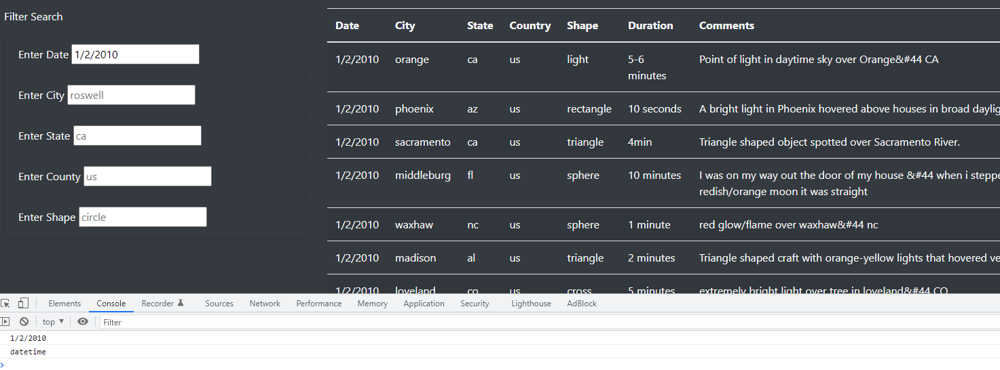
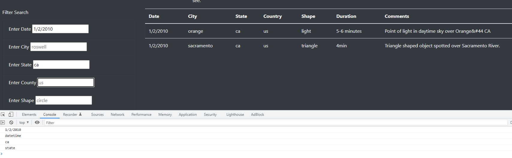
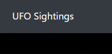

#  Display & Search UFO Sightings with JavaScript
## Overview 
Using JavaScript functions in combination with HTML & CSS, build and display a webpage that can filter UFO sighting data according to five different criteria. 
## Results 
- To search for sightings on the webpage, complete any of the available criteria. We will begin with the date:

*Here, you can see the search parameters are also printed to the console.* 
- Continue to add additional filters to the data: 

- Finally, to clear all filters, use the ‘UFO Sightings’ link in the navigation bar at the top of the page:

*Describe to Dana how someone might use the new webpage by walking her through the process of using the search criteria. Use images of your webpage during the filtering process to support your explanation.*
## Summary
One notable drawback of this design is the case sensitivity of the search fields. For example, I can search by sightings in California by typing **ca** but not **CA**. For future iterations of this code, data cleaning on all fields would be prudent before a presentation; all non-searchable fields and many of the searchable fields contain data in different formats and broken character codes. 

*In a summary statement, describe one drawback of this new design and two recommendations for further development.*
